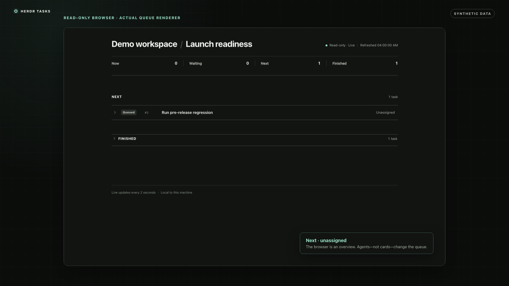
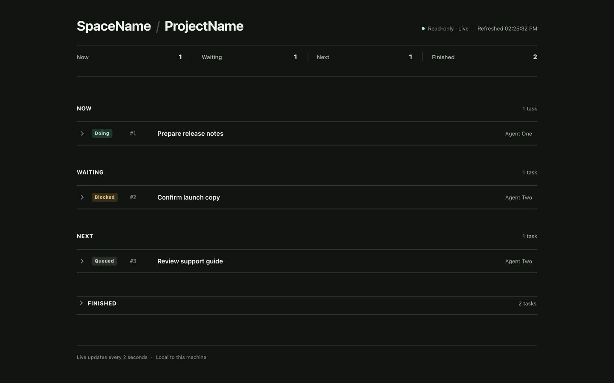
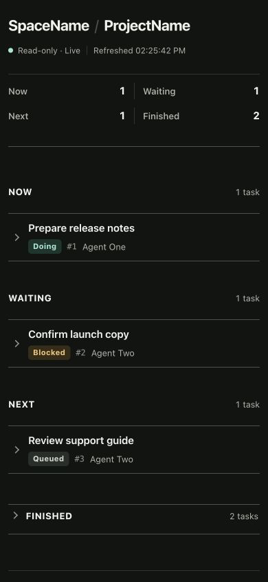

# Herdr Tasks

**Talk to your agents. Watch the work. Don't manage cards.**

[](https://github.com/Eslsamu/herdr-tasks/actions/workflows/test.yml)
[](LICENSE)
[](https://herdr.dev)

Herdr Tasks is a small local-first plugin for coordinating work across long-running agent conversations. Agents capture requests, own tasks, record blockers, and pull the next ready item. Humans get a live summary in Herdr and a clean, read-only queue in their browser.

[](docs/assets/herdr-tasks-demo.mp4)

[Watch MP4](docs/assets/herdr-tasks-demo.mp4) · [Watch WebM](docs/assets/herdr-tasks-demo.webm) · 24 seconds · silent · synthetic data

## Try it in two minutes

Inside a named Herdr session:

```sh
herdr plugin install Eslsamu/herdr-tasks --ref v0.3.1
herdr plugin action invoke setup --plugin herdr-tasks
```

Then tell an agent in that space:

> Read the installed `herdr-tasks` skill, join the `Demo` board, add “Review this README's setup steps,” and start it. Keep the queue current and take ready tasks in priority order.

While it is working, add a follow-up without stopping the current task:

> Keep going. Add “Review the result” for later and do not abandon your current task.

Open **Tasks: open space queue in browser** from Herdr's action menu. The agent owns the queue; the browser is a read-only live view. See [Install](#install) and [Start a queue](#start-a-queue) for the complete setup and operating model.

## Why it exists

When several agents work in parallel, a normal Kanban board creates another interface for the human to maintain. Herdr Tasks inverts that model:

- You keep talking to agents in their existing threads.
- Agents maintain the shared queue as part of their work.
- Each Herdr space maps to one queue.
- The browser view is for awareness, not task administration.
- No existing agent is started, stopped, forked, resumed, or replaced.

## What you get

| Surface | Purpose |
| --- | --- |
| Herdr top bar | Always-visible current task and queue counts for the active space |
| Local browser | Full **Now**, **Waiting**, **Next**, and collapsed **Finished** ledger |
| Agent CLI | Atomic claims, ownership, priorities, dependencies, notes, and outcomes |
| Codex skill | A workflow that teaches agents to maintain the queue themselves |
| Terminal fallback | Optional compact split for environments where a browser is undesirable |

The full view updates every two seconds while preserving expanded tasks, keyboard focus, and scroll position.



<p align="center">
  
</p>

## Install

Requirements:

- macOS or Linux
- [Herdr](https://herdr.dev) 0.8.2 or newer
- Python 3.10 or newer with `sqlite3` and `curses`
- Codex for the included agent workflow; the queue itself has no model API dependency

Inside a named Herdr session:

```sh
herdr plugin install Eslsamu/herdr-tasks --ref v0.3.1
herdr plugin action invoke setup --plugin herdr-tasks
```

Setup:

- links `herdr-tasks` into `~/.local/bin`;
- installs the agent skill at `~/.codex/skills/herdr-tasks`;
- adds the live active-space summary to Herdr's tab bar;
- starts local viewers for queues already linked to the session;
- preserves unrelated Herdr configuration and writes a backup before changing it.

No keyboard shortcut is assigned automatically. Open the current space through Herdr's action menu with **Tasks: open space queue in browser**. To add an explicit shortcut later:

```sh
herdr-tasks setup --key alt+t
```

Choose a binding your terminal actually delivers and that does not conflict with your existing Herdr or agent shortcuts.

### Local checkout

```sh
git clone https://github.com/Eslsamu/herdr-tasks.git
cd herdr-tasks
herdr plugin link "$PWD" --enabled
herdr plugin action invoke setup --plugin herdr-tasks
```

## Start a queue

Tell an agent in the space:

> Read the installed `herdr-tasks` skill, join the `ProjectName` board, and maintain it for the work I give you. Record later requests without abandoning your current task. Keep the board current and work through the authorized queue.

Or run the initial commands in that agent pane:

```sh
herdr-tasks join ProjectName
herdr-tasks list
```

Joining links the queue to that agent's current Herdr space. Other agents in the same space join the same board name. Renaming the Herdr space later does not break the binding because it uses the stable workspace ID.

Then talk normally:

> After your current task, fix CSV export and add saved filters.

The agent records and orders the requests. You do not need to create or move cards.

## Queue rules

- Tasks are `queued`, `doing`, `blocked`, `done`, or `cancelled`.
- Every task has at most one owner, and each owner has at most one `doing` task per board.
- Claims are atomic, so two agents cannot claim the same work.
- Priority `0` is highest; equal-priority tasks run oldest first.
- Optional dependencies must be done before a task can start.
- Completing, blocking, or cancelling work requires an explanatory note.
- Ownership follows the durable conversation ID: resume retains it, while a fork must join explicitly.
- Assigning work does not wake an idle agent or bypass normal approvals, usage limits, or credential handoffs.

## CLI

Global options go before the command: `herdr-tasks --board ProjectName list`.

```sh
# Queue membership and inspection
herdr-tasks join ProjectName
herdr-tasks list
herdr-tasks show 12

# Agent-owned task management
herdr-tasks add "Fix CSV export" --detail "Preserve quoted commas and Unicode."
herdr-tasks add "Write launch copy" --owner "Agent Two" --priority 4 --after 12
herdr-tasks next
herdr-tasks start 12
herdr-tasks update 12 --note "Reproduced; testing the parser fix."
herdr-tasks update 12 --status done --note "Quoted fields fixed; regression tests pass."
herdr-tasks update 13 --status blocked --note "Waiting for the domain choice."
herdr-tasks update 13 --status queued --note "Domain chosen; ready to continue."

# Human views
herdr-tasks open       # local browser for the current space
herdr-tasks pane       # optional compact terminal split
```

Read-only `boards`, explicit-board `list`, `show`, and terminal `view` also work outside Herdr. Writes require a Herdr agent with a reported durable conversation ID. `--agent NAME` is available for explicit operator enrollment and coordination; it does not silently transfer another agent's active work.

## Local and read-only by design

The browser viewer is served only on `127.0.0.1`. Each URL contains a random capability token and is pinned server-side to exactly one `(session, workspace, board)` binding. Query parameters cannot select another queue.

The HTTP surface:

- accepts only `GET` and `HEAD`;
- exposes a small display-only data shape without member actor IDs or durable conversation IDs;
- rejects foreign `Host` headers and all mutation methods;
- sends no CORS permission and uses a restrictive Content Security Policy;
- uses no external scripts, fonts, analytics, telemetry, or accounts.

This protects against accidental browser exposure, but it is not a security boundary between programs running as the same operating-system user. Treat task descriptions as potentially sensitive and do not store credentials or unrelated private conversation content in them.

## Data

The default database is:

```text
~/.local/state/herdr-tasks/tasks.db
```

Set `HERDR_TASKS_DB` to use another path. SQLite WAL supports concurrent agent writers and browser readers. Task data lives outside the repository and is never uploaded by the plugin.

When backing up an active database, use SQLite's backup facility or export a board with `herdr-tasks --board ProjectName list`; do not copy only the main `.db` file while WAL writes are active.

## Deliberate limits

- There are no prompt hooks and no background model execution.
- A request enters the queue when an agent processes the message at a safe tool boundary, not at the instant it is typed.
- The plugin cannot wake stopped threads, bypass usage limits, or guarantee model compliance.
- Blocked tasks require an explicit requeue after their blocker is resolved.
- Dependencies refer only to existing tasks on the same board.

## Remove

Inside Herdr:

```sh
herdr plugin action invoke uninstall --plugin herdr-tasks
herdr plugin uninstall herdr-tasks
```

For a linked checkout, use `herdr plugin unlink herdr-tasks` as the second command. Cleanup stops verified loopback viewers for the current session, removes only the plugin's own CLI/skill links and managed config block, and keeps all task data. It does not touch agent conversations.

## Develop

The runtime uses only the Python standard library and dependency-free HTML, CSS, and JavaScript.

```sh
python3 -m unittest -v
sh -n run.sh
```

The test suite covers queue ownership, concurrent claims, dependencies, resume/fork identity, configuration safety, terminal rendering, browser DTO privacy, immutable space routing, HTTP method/host/token rejection, live revisions, viewer restart/reuse, and installed CLI execution. CI runs on macOS and Linux with Python 3.10 and 3.14.

See [CONTRIBUTING.md](CONTRIBUTING.md) for development and pull-request guidance. Please report security issues according to [SECURITY.md](SECURITY.md).

MIT licensed.
